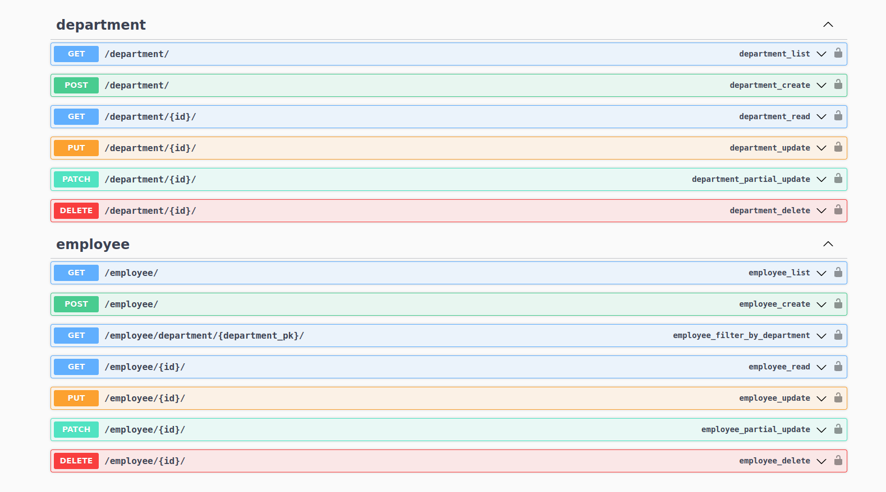

# Тестовое задание Руthon/Django/DRF

### Описание задачи:

#### Разработать АРI для представления структуры компании:
- Список департаментов
- Список сотрудников (как общий, так и по департаментам отдельно)
- Реализовывать методы необходимо через механизм DRF - ModelViewSet
- Для настройки ссылок (urls) АРI обязательно использовать DRF router

#### Модель данных:
Сотрудник содержит атрибуты:
- ФИО
- Фото
- Должность
- Оклад
- Возраст 
- Департамент

#### Департамент содержит:
- Название
- Связь с сотрудником - директором департамента

Должна быть обеспечена уникальности связки “сотрудник-департамент”.
Должен быть оптимизирован запрос поиска по фамилии сотрудника.

#### Админка
Должна быть реализована админка, в которой можно посмотреть на данные модели и их
модифицировать.

#### REST API
- API для получения списка сотрудников + реализовать фильтр для поиска по фамилии
и по id департамента
- Добавление/удаление сотрудников через API
- API для получения списка департаментов (включает искусственное поле с числом
сотрудников + поле с суммарным окладам по всем сотрудникам)
- API списком сотрудников - с пагинацией, API со списком департаментов - без
пагинации
- Доступ к списку сотрудников - только для авторизованных пользователей, доступ к
списку департаментов - доступен и для анонимных пользователей

### Ожидаемый результат
- Набор API методов для работы с данными по сотрудникам и департаментам
- Swagger документация по API методам
- Админка по модели данных

## Для запуска приложения используйте docker-compose:

    1. docker compose build
    2. docker compose up

Переменные заданы в файле `.env.example`.

##### Тестовый суперпользователь:

Логин: admin

Пароль: admin

### После запуска будут доступны:
- Админка `http://127.0.0.1:8003/admin/`
- Endpoints: `http://127.0.0.1:8003/api/v1/`
- Swagger `http://127.0.0.1:8000/docs/`

